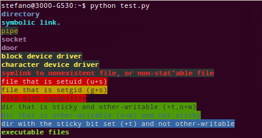

# ubuntu_hacks
my personal hacks and things that I want to remember about ubuntu (CTRL-SHIFT-M to preview in atom)

### Command Line Stuff
***
* `ifconfig` -- see connection and networking information
* `sudo nmtui` -- set up wifi in terminal
* `hostname -I` --see own ip address
* `ls -ltrh /dev/video*` --list all video devices plugged in
* Look for lost files (if you accidentally delete them):
`strings /dev/<partition> | grep -c $[<lines>*2] "<exact text>" >  </some/file/on/another/partition/file.txt>` Replace <partition> with the partition that your files were on, replace <lines> with how many lines you want to search in either direction when you find the text. Replace <exact text> with exact text you know was in your file. This will a text file with all of the bits from your file where it found the exact text you searched for + #of lines in each direction. The new partition where you create the txt file can be a partition on a flash drive or an external hard drive.
* `sudo fdisk -l` --show partitions on your computer
* `nmap -sP 192.168.0.1/24` --See all IP addresses on network
* ssh <username>@<IPaddress> --SSH into another computer
* `ps -ax` --shows all running processes
* `ps -ax | grep <desired program>` --search all processes for a desired program (use this if you need to kill something)
* `kill <process number>` -- kill a process. Replace <process number with number returned from `ps -ax | grep <desired program>`
* `df` -- show memory of all hard drives include `--block-size=g` to see in GB,`--block-size=m` to see in MB, and `--block-size=k` to see in KB
* `htop` --show processor and memory usage
* `scp username@ip:path/to/file/ /path/to/destination` --copy a file from SSH to local
* `scp /path/to/file username@ip:/path/to/destination` --copy a file from local to SSH
* `grep -rnw '/path/to/somewhere/' -e 'pattern'` --search for 'pattern' in files inside '/path/to/somewhere'.
  *  `-r` or `-R` is recursive,
  *  `-n` is line number, and
  *  `-w` stands for match the whole word.
  *  `-l` (lower-case L) can be added to just give the file name of matching files.
    Along with these, `--exclude`, `--include`, `--exclude-dir` flags could be used for efficient searching:

  * This will only search through those files which have .c or .h extensions:
    `grep --include=\*.{c,h} -rnw '/path/to/somewhere/' -e "pattern"`
  * This will exclude searching all the files ending with .o extension:
    `grep --exclude=*.o -rnw '/path/to/somewhere/' -e "pattern"`
  * For directories it's possible to exclude a particular directory(ies) through `--exclude-dir` parameter. For example, this will exclude the dirs dir1/, dir2/ and all of them matching `*.dst/`:

    `grep --exclude-dir={dir1,dir2,*.dst} -rnw '/path/to/somewhere/' -e "pattern"`

  more details can be found [here](https://stackoverflow.com/questions/16956810/how-do-i-find-all-files-containing-specific-text-on-linux "https://stackoverflow.com/questions/16956810/how-do-i-find-all-files-containing-specific-text-on-linux")

### General Ubuntu stuff
***
* `ctrl-alt-F1` through `F6` -- open terminal interface outside of GUI (helpful for recovery stuff)
* `ctrl-alt-F7` --enters GUI interface mode (normal mode)
* numlock default to on on startup:
  1. install numlockx `sudo apt install numlockx`
  2. add `greeter-setup-script=/usr/bin/numlockx on` to bottom of file: usr/share/lightdm/lightdm.conf.d/50-unity-greeter.conf
* when folders have green background in terminal. Usually caused by copying files from a flash drive or hard drive. See below for meaning:

  

  remove green background with `chmod o-rw <directory name>`

* move program to other monitor use compizconfig-settings-manager or ccsm with 'put' plugin and assign "put to next output" see [this link](https://askubuntu.com/questions/22207/quickly-place-a-window-to-another-screen-using-only-the-keyboard "https://askubuntu.com/questions/22207/quickly-place-a-window-to-another-screen-using-only-the-keyboard") for more details.
I have assigned it to `ctrl-super-m` on my computer.


### ROS Stuff
***
* View an image streaming in ROS: `rosrun image_view image_view image:=<topic>` or `rqt_image_view` then select the topic in the gui
* Echo a topic in ros repeating it in the same place rather than scrolling: `rostopic echo <topic> -c`
* Get info from mocap system: `rosrun vrpn_client_ros vrpn_client_node _server:=192.168.0.103 _refresh_tracker_frequency:=10`
* `export ROS_MASTER_URI=http://<ipaddress>:11311`
`export ROS_IP=http:$(hostname -I)` -- point to roscore on another machine to visualize on yours. You can replace <ipaddress> with either the tartget IP address of where you want to point to, or just the user name, if you have it saved in /etc/hosts with the IP address.
* To make Gazebo end quicker:
`sudo vi /opt/ros/kinetic/lib/python2.7/dist-packages/roslaunch/nodeprocess.py` and change the following variables
```_TIMEOUT_SIGINT  = 0.5 #seconds
_TIMEOUT_SIGTERM = 0.5 #seconds```

### Python Stuff
***
* Breakpoints and debugging in python: `from IPython.core.debugger import set_trace` or `from ipdb import set_trace` or `from pdb import set trace` (Depending on whether you are using iPython or just normal python) then use `set_trace()` in the line you want to insert the break point. Then when in the debugging mode, C-n moves to the next line and it works just like iPython live editor.

### Files In Repo
***
* resetusb.sh --resets usb drivers on computer. I use this when my computer stops detecting stuff like my keyboard
* terminator config. --sets up shortcuts for terminator to work how I like it.
* .alias -- aliases for navigating faster
* .vimrc -- personal vim settings
* .tmux.conf and .tmux.conf.local --my tmux settings. I got them from [this site](https://github.com/gpakosz/.tmux "https://github.com/gpakosz/.tmux"). Another good resource for shortcuts and hotkeys for tmux can be found [here](https://gist.github.com/MohamedAlaa/2961058,"https://gist.github.com/MohamedAlaa/2961058").
